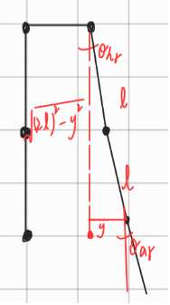
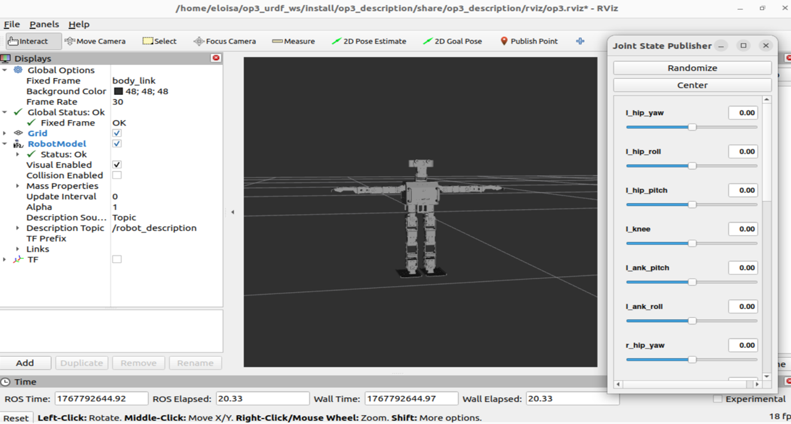

# OP3 RViz Demo Using ROS 2

---

## 📌 Overview

This repository presents a ROS 2–based visualization project for the ROBOTIS OP3 humanoid robot using RViz. The purpose of this project is to demonstrate the integration of OP3 URDF models with ROS 2 and to provide a clear and reproducible workflow suitable for academic projects, course assignments, and research demonstrations.

---

## 🤖 Introduction to OP3

ROBOTIS OP3 (Open Platform 3) is an open-source humanoid robot platform designed for robotics research and education. It provides modular hardware, extensible software, and comprehensive documentation, making it an ideal platform for studying robot kinematics, motion planning, and system integration. 

---

## 🛠️ System Environment

| Item                | Description |
| ------------------- | ----------- |
| Operating Framework | ROS 2       |
| Robot Model         | ROBOTIS OP3 |
| Visualization Tool  | RViz        |

This project has been developed for ROS 2–based workflows and focuses on URDF-based robot visualization.

---

## 🚀 Usage Instructions

Follow the steps below to build the workspace and visualize the OP3 robot model in RViz.

### Step 1: Download the Workspace

Download the `op3_urdf_ws` workspace and extract it to a local directory.

### Step 2: Configure Mesh File Paths


Open the `robotis_op3.urdf` file and modify the paths in each `<mesh filename="">` tag (e.g., `file:///home/...`) to match the actual mesh file locations on your local system.


### Step 3: Build and Launch the Project

Execute the following commands in the workspace root directory:

```bash
cd ~/op3_urdf_ws
colcon build
source install/setup.bash
ros2 launch op3_description display.launch.py
```

### Step 4: Execute the Inverse Kinematics Script
Open a new terminal window and navigate to the OP3 description directory. Before running the script, make sure the Joint State Publisher is closed.

```bash
cd ~/op3_urdf_ws/src/robotis-op3-common/op3_description
python3 op3_ik.py
```

Once launched, RViz will automatically open and display the OP3 robot model. 
After executing `python3 op3_ik.py`, the OP3 robot in RViz will move according to the inverse kinematics computation.

---
## 🦿Inverse Kinematics




## 🖼️ RViz Visualization

The following figure shows the OP3 humanoid robot successfully visualized in RViz using ROS 2:


*Figure 1. OP3 robot model visualization in RViz.*

---

## 🎥 Demonstration Video

[](https://www.youtube.com/watch?v=HrSheeFqyoc)

---

## 📚 Notes

* Ensure all mesh file paths in the URDF are correctly configured before building.

---
## Future Work

- Integrate OP3 into **Gazebo** for simulation.  
- Test various robot motions and behaviors in a simulated environment before deploying them on the real robot.
---

## References

- [ROBOTIS OP3 Official Manual](https://emanual.robotis.com/docs/en/platform/op3/introduction/)
- [ROBOTIS-OP3-Common GitHub Repository](https://github.com/Jay-Song/ROBOTIS-OP3-Common)
